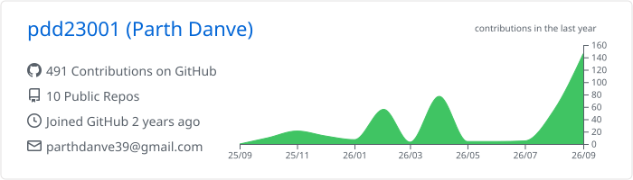
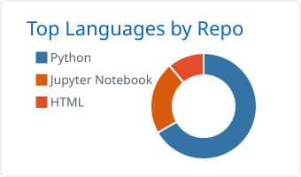
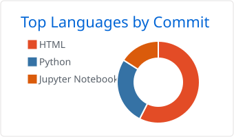

# Hi, I am Parth!

**I help build algorithms, tooling, and infrastructure for quantum computing.**

---

## About me

🎓 Computer Science @ UConn (Graduating 2027) 
⚛️ Built quantum software 
&nbsp;&nbsp;&nbsp;&nbsp;↳ @ <b>IBM</b> · May to Aug 2026 · Quantum Software Engineer Intern 
&nbsp;&nbsp;&nbsp;&nbsp;&nbsp;&nbsp;&nbsp;&nbsp;See what I built: [AQC Dynamics Template](https://github.com/qiskit-community/qiskit-function-templates/tree/main/physics/aqc_trotter) 
&nbsp;&nbsp;&nbsp;&nbsp;↳ @ <b>BosonQ Psi</b> · Jun 2025 to May 2026 · Quantum Computing Intern 
🔬 Researching hybrid quantum algorithms for optimization and simulation @ UConn 
🛠️ Qiskit Advocate (IBM), contributing upstream to Qiskit, Qiskit Serverless, and the IBM Quantum Platform docs 
🧠 Interested in quantum-inspired methods for classical machine learning 
🏆 Four podium finishes at 2025 and 2026 quantum hackathons: Yale and MIT iQuHack

## Toolkit

<table>
<tr>
<td><b>Quantum</b></td>
<td>

</td>
</tr>
<tr>
<td><b>ML</b></td>
<td>

</td>
</tr>
<tr>
<td><b>Languages</b></td>
<td>

</td>
</tr>
<tr>
<td><b>Tools</b></td>
<td>

</td>
</tr>
</table>

## Stats

